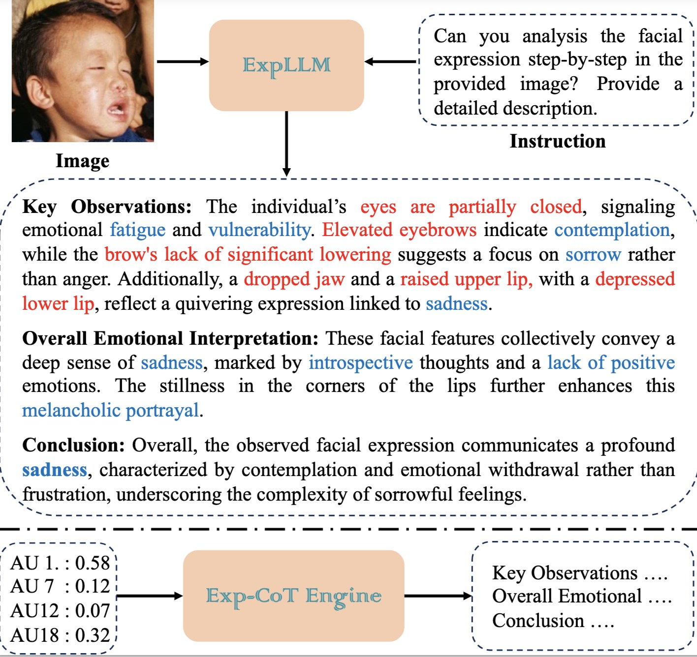
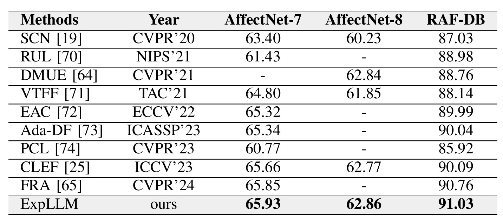
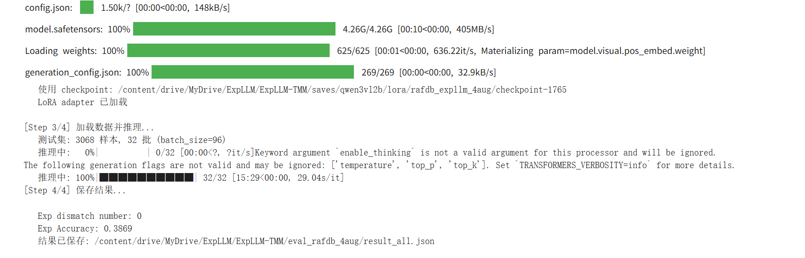

# ExpLLM: Towards Chain of Thought for Facial Expression Recognition

[[`arXiv`](https://arxiv.org/abs/2409.02828)][[`Paper`](https://ieeexplore.ieee.org/document/10948346)][[`Project`](https://starhiking.github.io/ExpLLM_Page/)]

> [ExpLLM: Towards Chain of Thought for Facial Expression Recognition](https://github.com/TheW1nc1/ExpLLM-qwen3-vl2B)  
> The_wind
> ```(Modified Version)```



## Installation

### 1. Clone code
```shell
    git clone https://github.com/starhiking/ExpLLM_TMM
    cd ./ExpLLM_TMM
```
### 2. Create a conda environment for this repo
```shell
    conda create -n ExpLLM python=3.10
    conda activate ExpLLM
```
### 3. Install CUDA 11.7 (other version may not work)
```shell
    conda install -c conda-forge cudatoolkit-dev
```
### 4. Install PyTorch following official instruction (should match cuda version)
```shell
    conda install pytorch==2.0.1 torchvision==0.15.2 pytorch-cuda=11.7 -c pytorch -c nvidia
```
### 5. Install other dependency python packages (do not change package version)
```shell
    pip install pycocotools
    pip install opencv-python
    pip install accelerate==0.21.0
    pip install sentencepiece==0.1.99
    pip install transformers==4.31.0
```
### 6. Prepare dataset
Download RAF-DB and AffectNet-Kaggle from website and put the zip file under the directory following below structure, (xxx.json) denotes their original name.

```
RAF-DB/basic/Image/aligned/
├── train*.jpg
└── test*.jpg

AffectNet-kaggle/
├── README.md
├── train-sample-affectnet.csv
├── valid-sample-affectnet.csv
├── train_class/
│   ├── class001/
│   │   └── *.jpg
│   ├── class002/
│   ├── class003/
│   ├── ...
│   └── class008/
└── val_class/
    ├── class001/
    ├── class002/
    ├── ...
    └── class008/
```
## Usage

### 1. Download trained model

```shell
    git lfs install

    git clone https://huggingface.co/starhiking/ExpLLM/tree/main

    mv ExpLLM/ckpts checkpoints/ckpts
    mv ExpLLM/model_weights checkpoints/model_weights

    # clone vicuna1.5
    cd checkpoints/model_weights
    git clone https://huggingface.co/lmsys/vicuna-7b-v1.5
```

### 2. Train and Eval Model
Change `IDX` option in script to specify the gpu ids for evaluation, multiple ids denotes multiple gpu evaluation.

```shell
    # train on raf-db
    bash scripts/train_rafdb.sh

    # evaluate on raf-db val set
    bash scripts/valid_rafdb.sh
```

Accuracy:

**1. Original ExpLLM (Vicuna-7B):**


**2. Qwen3-VL-2B Fine-tuned (RAF-DB):**
- **Exp dismatch number:** 0
- **Exp Accuracy:** 0.3869
- **Checkpoint:** `saves/qwen3vl2b/lora/rafdb_expllm_4aug/checkpoint-1765`



Note that GPU memory should not be less than 24GB.

### 3. Fine-tuning Qwen3-VL-2B (Analysis)

**Analysis on Qwen3-VL-2B Results:**
While the original ExpLLM based on Vicuna-7B achieves higher accuracy, our experiments with Qwen3-VL-2B demonstrate the feasibility of fine-tuning a significantly smaller Vision-Language Model. The accuracy reduction (to ~38.69%) is primarily constrained by the limited parameter capacity of the 2B model compared to the 7B model. 

However, fine-tuning on the 2B architecture holds substantial practical significance: it drastically lowers the hardware requirements, memory footprint, and training/deployment costs. This enables facial expression recognition research and edge computing applications to be easily accessible on consumer-grade GPUs, trading off some accuracy for massive efficiency gains.

## Contact me
If you have any questions about this code, feel free to contact me at 3066257338@qq.com.

## Acknowledgement
The code is mainly encouraged by [LocLLM](https://github.com/kennethwdk/LocLLM), [Pink](https://github.com/SY-Xuan/Pink) and [LLaVA](https://github.com/haotian-liu/LLaVA).
